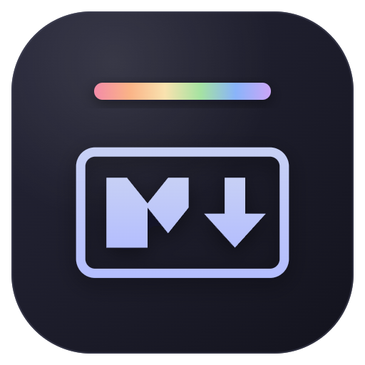

# MarkdownViewerPro

<p align="center">
  
</p>

MarkdownViewerPro 是一个专注于 Markdown 文档预览与导出的 VS Code 扩展。它提供主题切换、正文缩放、大纲导航、全文查找、自动刷新，以及 PDF、HTML 和 PNG 长图导出。

开源地址：[github.com/gcfkhy/vscode-office](https://github.com/gcfkhy/vscode-office)

## 功能

### Markdown 预览

- 使用 `markdown-it` 渲染 `.md` 和 `.markdown` 文件
- 支持原始 HTML、任务列表、标题锚点和文档目录
- 使用 Highlight.js 进行代码语法高亮
- 支持 KaTeX 数学公式、Mermaid 图表和 PlantUML
- 相对路径图片默认以 Markdown 文件所在目录为基准
- 点击外部链接时交给系统浏览器打开
- 渲染失败时回退显示原始文本，避免预览空白

预览是只读的。需要修改文档时，可切换回 VS Code 原生文本编辑器。

### 主题

内置 18 套预览主题，选择后会在所有 Markdown 文档中保持：

- 暗色：Catppuccin Mocha、Catppuccin Macchiato、Catppuccin Frappe、Dracula、Nord、One Dark、Tokyo Night、Gruvbox Dark、Solarized Dark、Rose Pine
- 亮色：GitHub Light、Catppuccin Latte、Solarized Light、Gruvbox Light、One Light、Rose Pine Dawn、Ayu Light、Tokyo Night Light

默认主题为 Catppuccin Mocha。

### 缩放

- 点击预览右下角的放大或缩小按钮，每次调整 `10%`
- 使用 `Ctrl/Command + 滚轮` 快速缩放
- 支持 `50%–300%` 的缩放范围
- 缩放时会在正文中央显示当前比例
- 点击比例提示可立即恢复到 `100%`
- 当前比例会被记忆，并应用到之后打开的 Markdown 预览

### 大纲

扩展会读取文档中的 `h1–h6` 标题并生成分层大纲：

- 点击条目平滑滚动到对应标题
- 阅读时自动高亮当前章节
- 可折叠存在子级的标题
- 支持推送正文和覆盖正文两种面板模式
- 面板宽度可在 `180–480px` 之间拖动调整
- 开关状态、显示模式和面板宽度会自动记忆

没有标题的文档不会显示大纲控件。

### 全文查找

在预览中按 `Ctrl/Command + F` 打开查找栏：

- 输入内容后即时查找并高亮匹配项
- 支持区分大小写
- 按 `Enter` 或 `F3` 跳到下一个结果
- 按 `Shift + Enter` 或 `Shift + F3` 跳到上一个结果
- 按 `Esc` 关闭查找栏
- 打开查找栏前选中的文本会自动填入搜索框

单次查找最多处理 5000 个匹配项，超过上限时计数后会显示 `+`。

### 自动刷新

扩展会精确监听当前 Markdown 文件，并在文件内容变化后重新渲染：

- 支持 VS Code 内未保存内容的预览联动
- 支持外部编辑器、格式化工具和原子保存产生的文件变化
- 预览重新变为可见时会主动检查一次文件内容
- 250 毫秒防抖可避免连续写入导致频繁重载
- 右下角提供手动刷新按钮作为兜底
- 每个文件的滚动位置会单独记忆并在重新打开时恢复

## 导出

预览右下角的导出菜单会按照当前预览主题生成文件。导出结果保存在 Markdown 文件所在目录，并使用相同的文件名：

| 格式 | 输出规则 | 是否需要 Chromium |
| --- | --- | --- |
| HTML | 内联预览样式，保留相对资源路径 | 否 |
| PDF | 优先生成与正文等高的单页 PDF，超出 Chromium 尺寸限制时自动改为分页 | 是 |
| PNG | 以 2 倍像素密度生成整页长图，尺寸过大时自动降为 1 倍重试 | 是 |

例如，导出 `notes.md` 会在同一目录生成 `notes.html`、`notes.pdf` 或 `notes.png`。如果目标文件已经存在，将直接覆盖。

超长文档即使降为 1 倍像素密度仍无法生成 PNG 时，扩展会提示改用 PDF。

编辑器标题栏中的导出命令还提供 PDF、HTML 和 DOCX 三种传统导出方式。其中 PDF 和 DOCX 需要 Chromium，HTML 不需要。

### 导出引擎

扩展按以下顺序选择导出浏览器：

1. `vscode-office.chromiumPath` 指定的可执行文件
2. 扩展缓存中的 `chrome-headless-shell`
3. 自动下载并缓存 `chrome-headless-shell`
4. 系统中已安装的 Edge、Chrome、Brave 或 Chromium

扩展启动后会在后台预下载导出引擎。简体中文环境优先使用国内镜像，下载失败时会尝试官方源，最后回退到系统浏览器。

## 使用方法

1. 在 VS Code 中打开 `.md` 或 `.markdown` 文件。
2. 如果没有进入预览，右键文件并选择“打开方式”，然后选择 `Markdown Preview`。
3. 使用预览右下角的控件打开大纲、切换主题、导出、缩放或刷新。
4. 使用 `Ctrl+Alt+E` 在 Markdown 预览和文本编辑器之间切换；macOS 使用 `Control+Command+E`。

## 常用设置

在 VS Code 设置中搜索 `vscode-office`：

| 设置项 | 作用 |
| --- | --- |
| `vscode-office.workspacePathAsImageBasePath` | 使用工作区目录而不是 Markdown 文件目录解析相对图片路径 |
| `vscode-office.chromiumPath` | 指定 PDF、PNG 和 DOCX 导出使用的浏览器可执行文件 |
| `vscode-office.puppeteerArgs` | 向导出浏览器传递额外启动参数 |
| `vscode-office.pdfMarginTop` | 设置传统 PDF 导出的顶部边距 |
| `vscode-office.pasterImgPath` | 设置在 Markdown 编辑器中粘贴图片时的保存路径模板 |
| `vscode-office.enableTelemetry` | 启用或关闭匿名使用数据收集 |

遥测遵循 VS Code 的全局遥测设置，详细说明见 [docs/telemetry.md](docs/telemetry.md)。

## 从源码构建

需要 Node.js 20.19 或更高版本。

```powershell
npm install
npm run build
npx @vscode/vsce package --no-dependencies
```

打包完成后，项目根目录会生成 `MarkdownViewerPro-<version>.vsix`。

## 主要依赖

- [markdown-it](https://github.com/markdown-it/markdown-it)：Markdown 渲染
- [Highlight.js](https://github.com/highlightjs/highlight.js)：代码高亮
- [KaTeX](https://github.com/KaTeX/KaTeX)：数学公式
- [Mermaid](https://github.com/mermaid-js/mermaid)：图表渲染
- [Puppeteer](https://github.com/puppeteer/puppeteer)：PDF 与 PNG 导出

## 许可证

本项目使用 [MIT License](LICENSE)。
